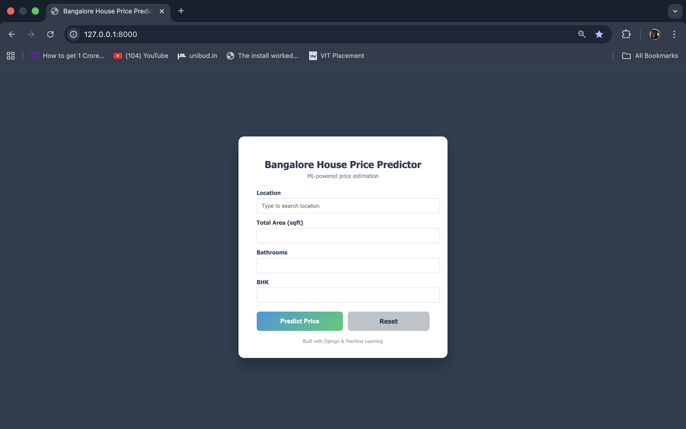
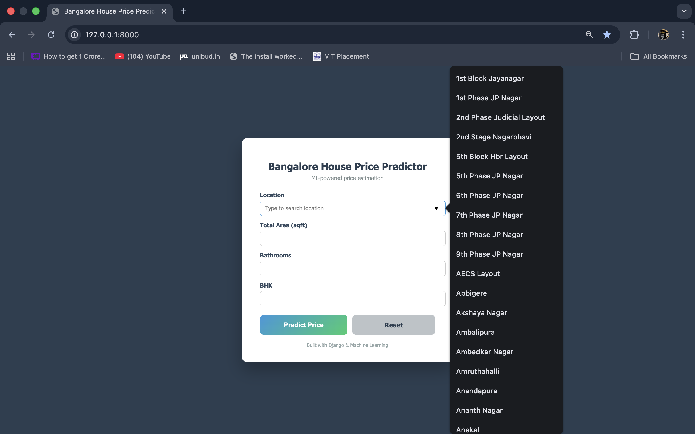
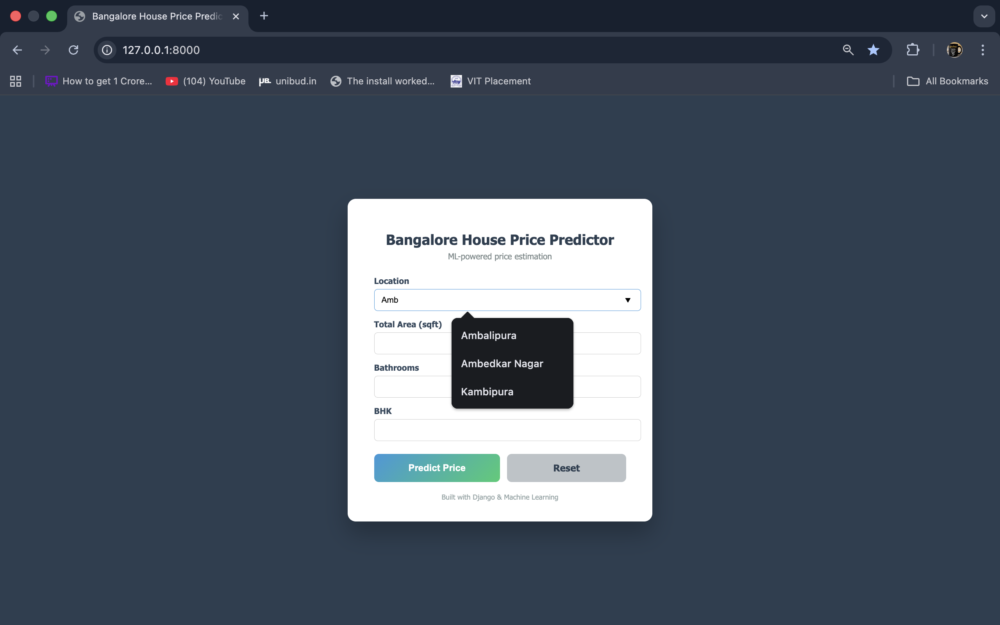
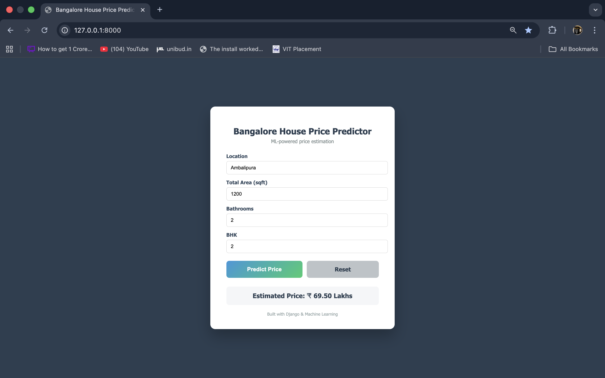

# 🏠 Bangalore House Price Prediction Web App

An end-to-end **Machine Learning web application** built using **Django** that predicts house prices in Bangalore based on location, area, number of bathrooms, and BHK.

---

## 🚀 Features

- 🔍 Searchable location input
- 📐 Area (sqft), Bathrooms, BHK inputs
- 🤖 ML model (Ridge Regression)
- 💰 Price displayed in **Lakhs / Crores**
- 🔄 Reset option
- 🎨 Clean & professional UI

---

## 🖼️ Project Screenshot







---

## 🧠 Machine Learning Details

- **Algorithm:** Ridge Regression
- **Preprocessing:**
  - OneHotEncoding for location
  - Feature scaling
- **Target:** House price (in Lakhs)
- **Libraries:** Pandas, NumPy, Scikit-learn

---

## 🛠️ Tech Stack

- **Backend:** Django
- **Frontend:** HTML, CSS
- **ML:** Scikit-learn
- **Language:** Python
- **Version Control:** Git & GitHub

---

## ⚙️ How to Run Locally

```bash
# Clone the repository
git clone https://github.com/<your-username>/bangalore-house-price-predictor.git

# Go to project folder
cd bangalore-house-price-predictor

# Create virtual environment
python -m venv venv
source venv/bin/activate  # macOS/Linux

# Install dependencies
pip install -r requirements.txt

# Run server
python manage.py runserver
